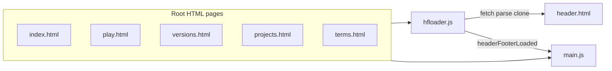

# Infiniconcept website conversion plan

## Current architecture (what you have today)

- **Shell pattern**: Each live page ([index.html](index.html), [play.html](play.html), [versions.html](versions.html), [projects.html](projects.html), [terms.html](terms.html)) ships empty placeholders and hides the body until shared chrome loads:

```86:88:c:\Projects\Web\Infiniconcept\index.html
  <!-- Loaded from header.html -->
  <header id="header" class="header d-flex align-items-center fixed-top">
  </header>
```

- **Loader**: [assets/js/hfloader.js](assets/js/hfloader.js) `fetch`es [header.html](header.html), parses it with `DOMParser`, selects `#header_eng` / `#footer_eng` or `#header_pol` / `#footer_pol` from cookie `citadel-universe-config` or browser `pl*` locale, clones into `#header` / `#footer`, then shows the body and fires `headerFooterLoaded`.
- **Behaviour layer**: [assets/js/main.js](assets/js/main.js) owns language cookie + `[lang="eng"|"pol"]` show/hide, Typed.js re-init on language change, delegated nav + `data-language` clicks calling `reloadHeaderFooter`, GLightbox, scroll helpers, and **inline background music** (`BACKGROUND_MUSIC_SONGS`, `toggleBackgroundMusic`, etc.—only referenced from footer markup in `header.html`, not a separate `music.js` on main pages).



- **Ignore [backup/](backup/) completely** (see **§ Scope** below).

**Live pages in repo root** (the **only** HTML destinations allowed in global nav and footer link lists): `index.html`, `play.html`, `versions.html`, `projects.html`, `terms.html`. Do **not** link from [header.html](header.html) or its footer to any other `.html` path (e.g. `extras.html`, `story.html`, `gallery.html`, `music.html`, `maps.html`, `history.html`, `newsarchive.html`)—those files exist only under `backup/` or are absent from root. In-page anchors on the five pages (e.g. `versions.html#remonstered`, `index.html#news`) remain valid.

---

## Scope: main folder only; `backup/` is out of bounds

- **“Main folder”** means the **repository root** where [header.html](header.html) and the live `*.html` pages sit—not `backup/`, not `files/`, not `assets/`.
- **`backup/` must be completely ignored** for this conversion:
  - **Do not** edit, reformat, or search-replace any file under `backup/`.
  - **Do not** add links from the live site to `backup/...` paths.
  - **Do not** include `backup/` in [sitemap.xml](sitemap.xml), [robots.txt](robots.txt) allowances, or [AGENTS.md](AGENTS.md) as part of the public site map.
- **Header and footer** ([header.html](header.html)): every `href` to an internal page must point **only** to one of the five root HTML files (plus same-page `#` anchors). **Audit** both nav and footer columns; remove **all** menu items, dropdowns, and list entries that target pages outside that set (e.g. drop **Extras** and any link to `newsarchive.html`, `maps.html`, etc.).
- **Root page body copy** (e.g. [index.html](index.html)): remove links to pages that are not in the root (e.g. news archive pointing at a non-deployed file).
- Optional: add **`backup/`** to [`.gitignore`](.gitignore) or **`.cursorignore`** only if you want tooling to skip it—**only if** you are comfortable excluding those files from version control or agent visibility (your choice; the plan does not require deleting the folder).

---

## 1. Rebrand to Infiniconcept (domain, meta, JSON-LD)

**Per-page `<head>`** on all five root HTML files:

- `title`, `meta name="description"`, `keywords`, `theme-color` (optional: align with logo/brand once chosen).
- `link rel="canonical"` and all Open Graph / Twitter URLs: `https://www.infiniconcept.com/` and path-specific canonicals.
- **JSON-LD**: Replace Citadel-centric `WebSite` / `Organization` with Infiniconcept (studio name, URL, description). Drop or replace `SearchAction` unless you add real on-site search—it is Citadel-specific today ([index.html](index.html) lines 41–54).
- **Google Analytics**: Keep the existing gtag snippet in place but **wrap the entire GA block in HTML comments** (`<!-- ... -->`) so nothing runs until you uncomment it. Apply this on the **five root HTML pages only** ([index.html](index.html), [play.html](play.html), [projects.html](projects.html), [versions.html](versions.html), [terms.html](terms.html)). Do **not** change [backup/](backup/) files for this. Leave the measurement id `G-76MNKFFZGK` inside the commented block for reference until you replace it after creating a GA4 property for infiniconcept.com.

**Global files**

- [robots.txt](robots.txt): update `Sitemap:` to `https://www.infiniconcept.com/sitemap.xml` (and optionally the host name in comments if any).
- [sitemap.xml](sitemap.xml): **only** the five URLs above; remove entries for pages not deployed; set `<loc>` to `https://www.infiniconcept.com/...`; refresh `<lastmod>` when you ship.
- [site.webmanifest](site.webmanifest): `name` / `short_name` / `description` for Infiniconcept; point `icons` at your chosen favicon set (see below).

**Favicons / PWA icons**

- Prefer the set already under [assets/icons/](assets/icons/) (`favicon.ico`, `favicon-16x16.png`, `favicon-32x32.png`, `favicon-96x96.png`, `icon_256.png`) in `<link rel="icon" ...>`, `apple-touch-icon`, and `site.webmanifest` `icons` (add multiple sizes as required by [Web App Manifest](https://developer.mozilla.org/en-US/docs/Web/Manifest) best practice).
- Remove or stop referencing Citadel-specific assets in heads (`assets/img/citadel*.png`, `citadel.ico`) for public pages once replacements are wired.

---

## 2. Header and footer ([header.html](header.html))

**Hard rule — link whitelist**

- Header **nav** and **footer** “Useful links” / secondary columns may reference **only** these internal pages: `index.html`, `play.html`, `versions.html`, `projects.html`, `terms.html` (with optional `#fragment`). Remove every other internal `.html` target, including **Extras** and links to `newsarchive.html`, `maps.html`, `story.html`, etc.

**Navigation (English only, pages that exist)**

- Primary items that fit the current structure: **News** (`index.html#news`), **Play** (`play.html`), **Versions** (`versions.html` + existing in-page anchors), **Projects** (`projects.html` + `#axion` if kept), plus **Terms** only if you want it in the bar (today it lives under footer “Useful links”—either keep that pattern or add a slim “Legal” link).
- **Remove** the entire **Extras** dropdown (it points at non-root pages).
- **Remove** the **gear** dropdown (Language + Music link)—no language switch, no music deep-link.

**Logo (your requirement)**

- In **both** header brand link and footer “about” brand (for consistency): replace `assets/img/citadel64x64.png` + `Citadel Universe` heading/text with **`assets/img/logo_300_40.png`** as the primary mark.
  - Adjust markup/CSS so the bar stays aligned (height, `object-fit`, responsive max-width). If the wordmark is sufficient, you may use a single `` and drop the separate `<h1 class="sitename">` or keep a visually hidden site name for accessibility—decide based on whether the PNG already contains the wordmark (filename suggests it does).

**Polish duplicate blocks**

- Delete `#header_pol` and `#footer_pol` entirely; keep a **single** header and single footer template (conceptually the old `_eng` blocks, renamed to neutral ids `#header_template` / `#footer_template` **or** keep cloning from `#header_eng` / `#footer_eng` for minimal `hfloader` diff).

**Footer**

- Remove the **second** `social-links` row with `#background-music-toggle`, prev/next, and counter (both locales’ copies).
- Update “Useful links” / second column lists: drop **Extras**; ensure no `newsarchive.html` if that page is not shipped (today [index.html](index.html) links to it—remove or replace with an on-page “Older news” subsection).

**Social (explicit removals)**

- **Remove** all **PayPal donation** and **Reddit** links and icons everywhere they appear: [header.html](header.html) footer social row, [index.html](index.html) hero `social-links`, and any other root-page copy that links to Reddit or PayPal.
- **Discord / Twitch** (and any other remaining icons): update to **Infiniconcept’s** official URLs when you have them, or keep as placeholders / hide until confirmed—do **not** reintroduce Reddit or PayPal.

---

## 3. Remove music player and related assets

- **HTML**: Footer controls removed (above).
- **JS**: Delete the background-music block and exported globals from [assets/js/main.js](assets/js/main.js) (from `BACKGROUND_MUSIC_SONGS` through `window.backgroundMusicChange`), and the delegated handler for `a[href="#background-music-toggle"]`.
- **CSS**: Remove `.footer ... #background-music-*` rules from [assets/css/main.css](assets/css/main.css) (and [assets/css/main.min.css](assets/css/main.min.css) if you maintain it in sync).
- **Assets (optional cleanup)**: Delete [assets/music/](assets/music/) tree and [assets/vendor/basoon/](assets/vendor/basoon/) if nothing references them after removing backup-only music page usage.

---

## 4. English-only: strip Polish and simplify loaders

- **All root HTML**: Remove every `lang="pol"` element and any `hidden` attributes used only for Polish alternates; collapse duplicate headings/paragraphs to one English block per region.
- **Affected files** (from repo scan): [index.html](index.html), [play.html](play.html), [projects.html](projects.html), [versions.html](versions.html), [terms.html](terms.html)—large `terms` / `versions` Polish sections are extensive but mechanical to delete.
- **[assets/js/hfloader.js](assets/js/hfloader.js)**: Remove `getLocale`, cookie name, and branch logic—always inject the single header/footer fragment (e.g. always `#header_eng` / `#footer_eng` or renamed ids).
- **[assets/js/main.js](assets/js/main.js)**:
  - Remove `CONFIG_COOKIE_NAME` usage **if** it was only for language (verify nothing else stores there).
  - Remove `CONTENT_LANG_CODES`, `applyLanguageVisibility`, `initLanguage` cookie/`pl` detection, `data-language` click handling, `reloadHeaderFooter` integration, and `window.citadelLanguage` (or replace with a static `window.siteLanguage = "en"` only if something else needs it).
  - Simplify **Typed.js** init: one `.typed` element per page without language branching.

---

## 5. Body content and IA (beyond chrome)

This is where “studio site” vs “Citadel fan hub” diverges—plan the copy pass explicitly:

- **[index.html](index.html)**: Hero line, Typed strings, About blurb, and News items should describe **Infiniconcept** as an indie developer, flagship titles (Citadel line / WebGL / remasters if still your product story), and contact CTAs. Remove PayPal and Reddit from hero social links (see §2). Remove the news-archive link or point to a **future** `news.html` if you add it to root.
- **[projects.html](projects.html)**: Retitle section from “Citadel Universe Projects” to studio framing (e.g. “Games & projects”) while keeping game-specific cards where accurate.
- **[play.html](play.html) / [versions.html](versions.html)**: Keep technical accuracy; update intros so they read as products **by Infiniconcept** / legacy Virtual Design lineage as appropriate.
- **[terms.html](terms.html)**: Replace “Citadel” site naming with Infiniconcept; update privacy bullets to remove references to **language** cookie; align the **Analytics** subsection with reality (GA commented out / inactive) or phrase it as conditional (“if enabled”) so it stays accurate when you later uncomment gtag. Remove or rewrite any **Reddit** / **PayPal** mentions in terms (e.g. third-party links, community, donations) so they match the live site.

---

## 6. Additional recommendations (post-rebrand polish)

- **404 page**: Add `404.html` with the same header/footer pattern for GitHub Pages or static hosts.
- **Consistent OG image**: Use a dedicated `og:image` (e.g. logo on brand background) hosted at `https://www.infiniconcept.com/...`, not legacy box art, unless you intentionally promote a specific game.
- **Accessibility**: Ensure one visible `<h1>` per page after logo change; verify keyboard/mobile nav still works after removing the gear menu.
- **README / internal docs**: Briefly document build/deploy (optional; only if you want the repo self-explanatory).
- **Asset hygiene**: Large `files/` and `assets/img` Citadel archives can stay for downloads, but consider whether public-facing copy should still imply “official Citadel Universe” vs “Infiniconcept preserves Citadel.”

---

## 7. Agent-facing documentation (deliverable you requested)

Add **`AGENTS.md`** at the repository root (Cursor and other agents commonly read this) describing:

- **Site purpose**: Infiniconcept — independent games developer; public URL `https://www.infiniconcept.com`.
- **Page map**: The five root HTML files and primary anchors (`#news`, `#about`, version sections, `#axion`, terms sections).
- **Layout system**: `header.html` + `hfloader.js` injection; `main.js` for nav, GLightbox, Typed, scroll; no server-side includes.
- **Conventions**: English-only; no `lang="pol"`; **header/footer and sitemap may link only to the five root `*.html` files** (see whitelist in §2); no links into `backup/`; branding assets paths (`assets/img/logo_300_40.png`, `assets/icons/...`); **no PayPal donation or Reddit** links on the public site.
- **What not to restore**: Footer music, bilingual chrome, or links to pages outside the root whitelist.
- **`backup/`**: Not part of the live site; **do not modify** files under `backup/` during conversion; do not link to them from production HTML.
- **Analytics**: Document that Google Analytics is present in root HTML **inside HTML comments** until the site owner enables it.

Optionally add **`.cursor/rules/infiniconcept-site.mdc`** (or a single rule file) that points agents at `AGENTS.md` for full detail—keeps rules short.

---

## Implementation order (suggested)

1. **`header.html`**: Single-locale header/footer; **audit all `href`s**—only the five root pages; nav trim; logo swap; remove music row and gear menu; remove PayPal and Reddit from footer socials; update remaining social URLs as needed.
2. **`hfloader.js`**: Single fragment selection; drop locale cookie reads.
3. **`main.js`**: Remove language + music; simplify Typed; rename/remove `citadelLanguage` if unused.
4. **Root HTML**: Strip Polish; comment out gtag blocks; update heads/meta/JSON-LD; fix internal links (news archive, etc.); align body copy with studio positioning.
5. **`main.css`** (and minified if applicable): Remove music styles.
6. **`site.webmanifest`**, **`sitemap.xml`**, **`robots.txt`**, favicon links on all pages.
7. **Delete** unused audio/vendor files if desired.
8. **`AGENTS.md`** (+ optional `.cursor/rules` pointer).

---

## Actions for you later (owner checklist)

These are **not** automated implementation steps; do them when you are ready after or alongside the conversion.

1. **Google Analytics**: Create a GA4 property (or measurement stream) for **www.infiniconcept.com**, obtain a new **Measurement ID** (`G-XXXXXXXXXX`), replace `G-76MNKFFZGK` inside the commented gtag block in each root HTML file, then **uncomment** the GA block on all five pages when you want tracking live.
2. **DNS and hosting**: Point **www.infiniconcept.com** (and apex **infiniconcept.com** if needed) to your static host; enable HTTPS; verify canonical URLs match the live host.
3. **Social and community links**: Replace legacy Citadel **Discord** / **Twitch** URLs in [header.html](header.html) and body copy with Infiniconcept’s official channels when ready, or remove/hide those icons until URLs exist. (**PayPal** and **Reddit** are removed as part of the conversion—not an owner follow-up.)
4. **Brand visuals**: Confirm **theme-color**, Open Graph / Twitter **og:image** (and optional `icon_256` / apple-touch assets) match your final logo and palette—not legacy Citadel art unless intentional.
5. **Legal copy**: Have [terms.html](terms.html) (and privacy sections) reviewed for your jurisdiction and for **Infiniconcept** as the named entity; update the Analytics paragraph when gtag is enabled and the measurement id changes.
6. **Optional site improvements** (from recommendations above): add a **404** page for your host, ship a dedicated **news** or archive page if you outgrow the homepage news list, and refresh **README** with deploy notes if collaborators join.
7. **Search / JSON-LD**: If you never add on-site search, keep `WebSite` JSON-LD without `SearchAction`, or add it later when search exists.
